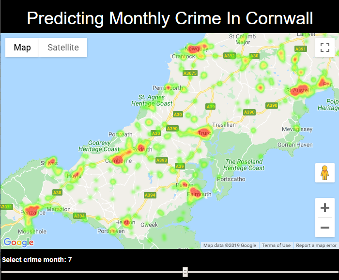

## Project Overview
Carry out data analysis on a police crime dataset.  From the data analysis prouduce a series of coordinates representing monthly crimes in Cornwall.  These coords are then used with Google Maps api to allow a crime scene data map to be produced in the browser.

## Project Steps
Below are the steps taken to complete each component of this project.

### Data Analysis
- Download Cornwall crime data from [Police Data](https://data.police.uk/data/)
- Clean, analyse and process the crime data.  Write the relevant geo coordinates that can be used bu Google Maps API

### Build Flask App
- Use Flask, html and javascript to build a Flask Application
- Get a Google Maps API key: [API Key](https://developers.google.com/maps/documentation/javascript/get-api-key).
- Integrate the [API key and HeatMap code](https://developers-dot-devsite-v2-prod.appspot.com/maps/documentation/javascript/examples/layer-heatmap) into the Flask application code 

### Output of code

Here is a screenshot showing the busiest month for crime in Cornwall - July when hundreds of thousands of people flock to Cornwall for the Summer.

Enough
